# Design and Analysis of Algorithms – Assignment 2

## Pair 3: Linear Array Algorithms

### 👩‍🎓 Student B – Kadane’s Algorithm
**Algorithm Name:** Maximum Subarray Sum with Position Tracking
**Course:** Design and Analysis of Algorithms  

---

## 📘 Description
This project implements **Kadane’s Algorithm**, an efficient linear-time solution to find the **maximum subarray sum** within a one-dimensional array of integers.  
In addition to the maximum sum, this implementation also **tracks the start and end indices** of the subarray that produces this sum.

Kadane’s Algorithm is based on the idea that the maximum subarray ending at position *i* is either:
- The element itself, or  
- The element plus the maximum subarray ending at *i–1*.

---

## ⚙️ How It Works
1. Initialize `maxSum` and `currentSum` to the first element of the array.  
2. Traverse the array from left to right:
   - Add the current element to `currentSum`.
   - If `currentSum` becomes less than the current element, start a new subarray.
   - If `currentSum` exceeds `maxSum`, update `maxSum`, `start`, and `end` indices.
3. Print:
   - Input array  
   - Maximum subarray sum  
   - Start and end indices  
   - Subarray elements

---

## 💻 Example Output
```

Input Array: [ -2 -3 4 -1 -2 1 5 -3 ]
Maximum Subarray Sum: 7
Start Index: 2
End Index: 6
Subarray: [ 4 -1 -2 1 5 ]

````

---

## 🧩 UML Diagram
**File:** `KadaneAlgorithm.puml`

```plantuml
@startuml
title Kadane's Algorithm (Student B)

class KadaneAlgorithm {
  +findMaxSubarray(array: int[]): void
  +main(args: String[]): void
}

KadaneAlgorithm : int maxSum
KadaneAlgorithm : int currentSum
KadaneAlgorithm : int start
KadaneAlgorithm : int end
KadaneAlgorithm : int tempStart
@enduml
````

---

## 🧮 Complexity Analysis
- **Time Complexity:** O(n) — the array is scanned only once.
- **Space Complexity:** O(1) — only a few variables are used to store sums and indices.

---

## 🧠 Clean Code Principles Used

* **Meaningful variable names** (e.g., `currentSum`, `maxSum`, `start`, `end`).
* **Single responsibility** — each method performs a clear function.
* **Readable structure** — logical flow with proper indentation.
* **Inline comments** explaining key operations.
* **Descriptive output** for clarity and testing.

---

## 📂 Files Included
- `KadaneAlgorithm.java` – main algorithm implementation
- `KadaneAlgorithm.puml` – UML diagram
- `README.md` – short project description
- `REPORT.md` – analysis report for submission

---

## 🧾 Example Test Arrays

You can modify the array in the code to test different cases:

```java
int[] array1 = { -2, -3, 4, -1, -2, 1, 5, -3 };  // Example 1
int[] array2 = { 1, 2, 3, 4, 5 };               // All positive numbers
int[] array3 = { -1, -2, -3, -4 };              // All negative numbers
int[] array4 = { 2, -1, 2, 3, 4, -5 };          // Mixed case
```



---

## 🧩 Results and Conclusion

Kadane’s Algorithm efficiently finds the maximum subarray sum in **O(n)** time, which is optimal for this problem.
It is simple, elegant, and widely used in **dynamic programming** and **data analysis** applications.
This implementation also enhances the original algorithm by **tracking subarray positions**, making it more informative and useful for real-world applications.
